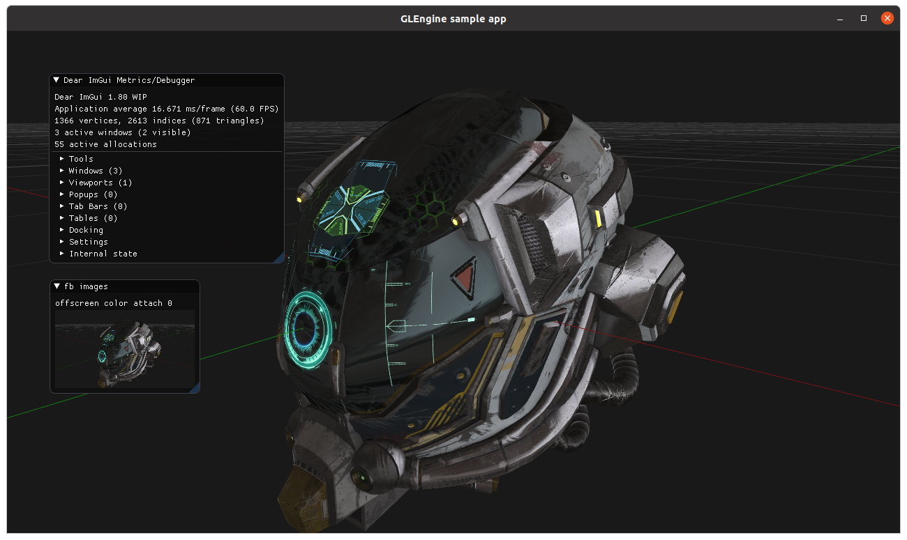
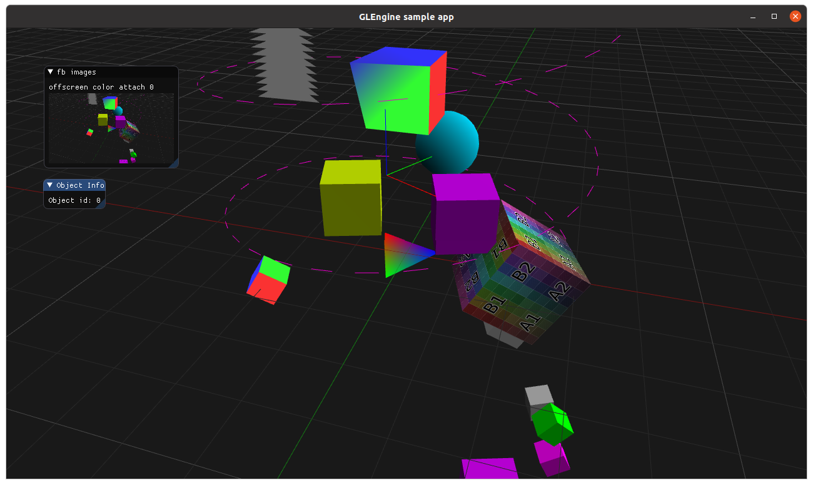
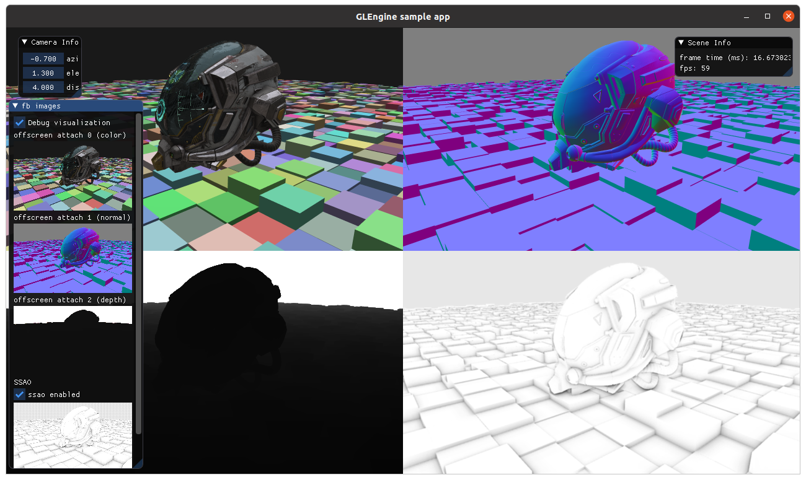

GLEngine
========

Basic visualizer for rapid prototyping

## Renderables and scene graph
The engine basic unit is the Renderable, that is composed by a mesh and a material. All what the engine is doing is
manipulating, transforming and passing those renderables to the Renderer.
The renderables are typically attached to objects organized in a scene graph; each node of the graph has a parent and
zero or more children.

## Renderer
The Renderer has a fixed pipeline, composed by several stages:

1. Forward rendering
2. Debug/Annotations

The basic idea is to walk the scene graph(s) and create a sequence of rendering commands that will be submitted to the GPU.
Each stage has his own command queue, and the commands in the queue can be sorted in order to:

* minimize the state changes (shaders, etc)
* sort back-to-front or front-to-back 

### Forward Rendering Stage
Objects with a material that requires forward shading will be rendered in this stage. This includes VertexColor, Flat color, etc.
Objects in this stage will be selectable, with the possibility to query the object ID for a specific screen coordinate.

### Debug Annotations (to be implemented)
Additional rendering that can be useful as debug/annotations, like text, bounding boxes, etc.
Objects in this stage will *not* be selectable.

The `master` branch contains an active rewrite of GLengine on top of [sokol_gfx](https://github.com/floooh/sokol), and is probably not very stable at the moment.

## Screenshots
A few screenshot from the sample apps:

The previous version of the library can be found in the followin branches:
* `glengine_opengl`: version implemented directly in OpenGL 3.3+; supports deferred rendering and object selection with a similar API
* `glengine_simplified`: version implemented in OpenGL 3.3+ with only forward rendering and a simplified API

# Internals

Resource ownership
------------------
The resource ownership model is very simple, by design. For every resource (essentially memory allocations like buffers, images, etc.):
* if created by the engine is managed by the engine
* if created by the user has to be managed by the user
* renderables are ephemeral and _copied_ into the glengine::Object. Make sure to always update the one in the final object, not a temporary object created when _constructing_ the object itself 

Why sokol
---------
Compared to the previous generation of GLEngine, the actual version has been built on top of the awesome [sokol_gfx](https://github.com/floooh/sokol) library, that provides a very thin abstraction for OpenGL/Metal/DirectX/WebGL.
The previous version was built directly on top of OpenGL (hence the "GL" in the name), but the OpenGL support in many platforms (read: macOS) is getting worse over time and I also wanted to be more future-proof and have a path to use the same tech on web applicaitons. 
In terms of performance for example, the benchmark app runs at ~25 fps on my Macbook pro 13 (late 2018) on macOS, but at a steady 60 fps _with the same code, on the same machine_ when I boot from a linux usb-stick...

Sokol Gfx has been chosen because:
* it supports more than one platform/gfx api, with likely more to come
* render passes and pipelines are implemented very well
* it's low-level enough to have total flexibility on the architecture
* it comes with a very good validation layer in debug (useful for troubleshooting tricky opengl buffers/pipelines incompatibilities, for example)
* it's minimalistic and incredibly easy to integrate
* it comes with a cross platform solution for the shading language (integrated in GLEngine) that uses glsl, but also offers the possibility to write shaders in the native API shading language if needed.
* it comes with a few other small libraries like sokol_app, sokol_fetch, sokol_time that can optionally be used and are based on the same concepts

There are a few things that are not supported (yet...), but compared to the benefits they are very minor. For example:
* all render targets _must_ have the same pixel format (i.e. not possible to use MRT with color+float+depth textures)
* no cross platform support to copy images/textures from GPU back to the main memory

TODO
----
The library is under active development, and the main features that under work are:
- [x] dynamic meshes (update mesh data)
- [ ] generate mipmaps
- [x] gltf import
- [x] support PBR materials (using gltf as reference)
- [ ] object selection (ID buffer)
- [x] re-implement SSAO
- [ ] consistent color spaces (sRGB for both meshes and textures in all shaders)
- [x] improve PBR materials
- [ ] move to cgltf
- [x] use HDR diffuse and specular images for IBL
- [ ] resize offscreen context on window/fbuffer resize
- [ ] support translucent materials
